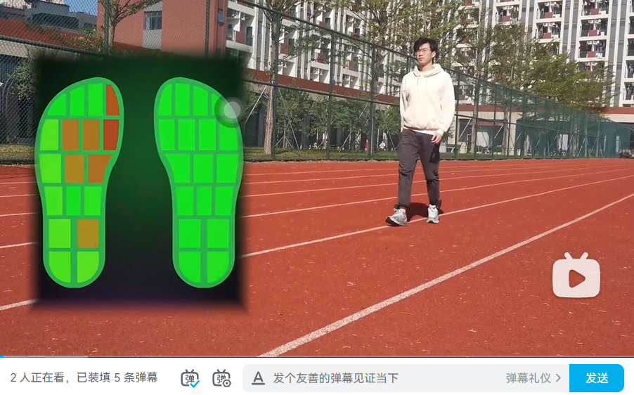

# 项目前言

本项目基于ESP32开发了一款可穿戴的压感鞋垫设备，实时采集足底各个部位的压力数值，并通过无线传输发送给上位机设备。此外，为了对压力数据进行更好的可视化和预测分析，本项目还开发了一款IOS应用，对压力数据进行实时可视化以及存储。

# 如何使用

本项目主要分为三个模块，分别是ESP32硬件设备的设计制造，ESP32功能代码的开发以及IOS应用的开发，三个模块已经全部开源。

## 1.ESP32硬件设备

- ### 开发环境

  立创EDA专业版

- ### 使用方法

  使用立创EDA专业版打开Pressure_Insole_LCEDA.zip工程文件，根据需要导出相关的原理图和PCB等文件。建议使用嘉立创下单助手一键完成设备的打印制造。

## 2.ESP32功能代码的开发

- ### 开发环境

  VS Code和PlatformIO

  相关的配置方法可以参考教程https://randomnerdtutorials.com/vs-code-platformio-ide-esp32-esp8266-arduino/

- ### 使用方法

  基于打印制造好的两块PCB设备，连接好压力传感器，并通过Type-C数据线连接电脑，再分别将Pressure_Insole_Left和Pressure_Insole_Right项目烧录进对应的左脚和右脚的设备。

## 3.IOS应用开发

- ### 开发环境

  Xcode(这是Mac专属应用，如果没有的话可以再ESP32功能代码开发中使用前端开发来替代。)

- ### 使用方法

  使用Xcode打开FL_Rehab项目，连接好iphone或者ipad之后，将软件烧录到设备中。设备连接到ESP32热点上，即可开始接受设备数据并实时可视化。

